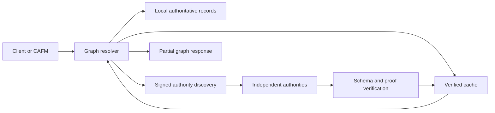
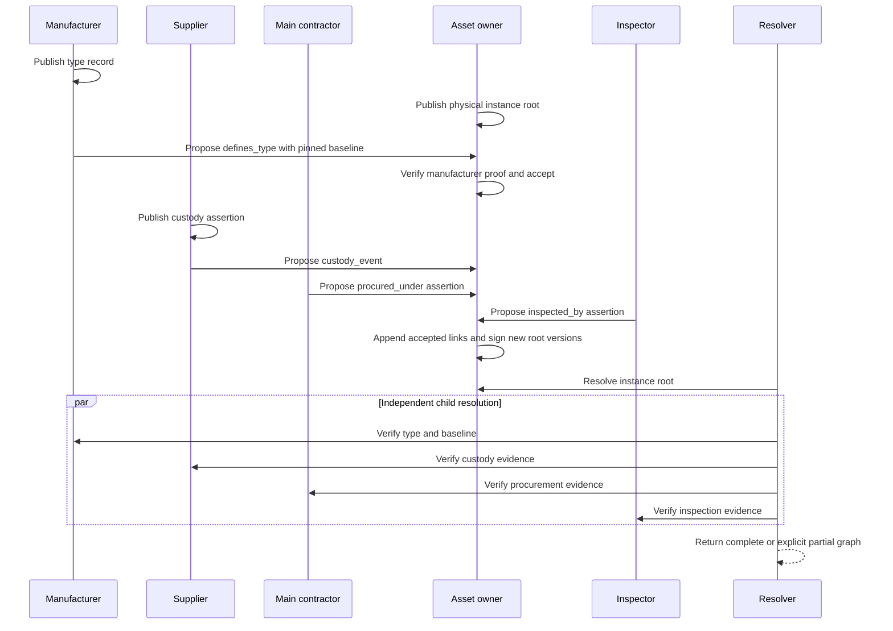
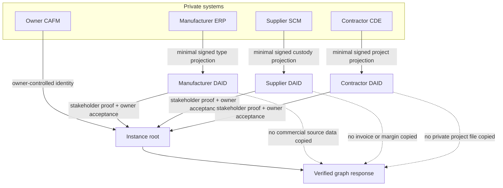

# DAID 3.0 Architecture

## Trust Model

A DAID identifies a logical record and binds it to an Ed25519 genesis-key
fingerprint. DNS and HTTP locate an authority for the current request; they do
not establish authority. A resolver accepts a record only when the signed
descriptor fingerprint matches the DAID, the named verification method has the
required purpose, the record identity matches the request, and its RFC 8785
canonical proof verifies.

No node is a global registry. Every authority controls only its own records;
the owner controls the instance root and which external assertions it accepts.

## Asset Lifecycle

The lifecycle is an append-only evidence graph. Product facts, custody,
procurement, installation, inspection, maintenance, and decommissioning remain
signed by the organizations responsible for those claims.

A later manufacturer update cannot rewrite the installed baseline. The
`defines_type` edge pins the accepted type version and canonical SHA-256 digest.
Corrections publish a new record version or superseding assertion.

## Data Governance

DAID separates control of evidence from aggregation of evidence. This avoids a
single asset database becoming an accidental owner of every participant's data.

This addresses common governance failures:

| Governance problem | DAID control |
|---|---|
| One party silently edits another's facts | Every authority signs only its own record or assertion |
| DNS or hosting takeover impersonates an issuer | The identifier binds to a key fingerprint |
| Aggregator becomes the source of truth | The owner stores signed pointers and acceptance, not copied claims |
| Product data changes after installation | Accepted type relationships pin version and digest |
| Supplier disappears | Verified cached evidence remains usable and is marked stale |
| Missing evidence is hidden | Graph responses preserve failed edges and explicit reason codes |
| Sensitive commercial data spreads | Authorities publish minimal projections from private source systems |
| Audit history is overwritten | Updates append immutable signed history versions |

## Record And Relationship Writes

Record publication builds the complete envelope, normalizes it through the
Pydantic wire model, canonicalizes it with RFC 8785, and signs every field except
`proof`. Storage retains the complete JSON document and received payload.

Cross-authority relationships use two proofs:

1. The target stakeholder signs a proposal whose `target` is its authoritative
   record.
2. The root owner resolves the target descriptor, verifies the assertion proof,
   appends an acceptance proof, and publishes a new signed root version.

Ordinary record updates cannot change the relationship list. This prevents a
write client from bypassing the consent workflow.

## Resolution And Failure

`POST /v3/resolve-graph` performs bounded breadth-first traversal with a visited
set, depth limit, and node limit. Links are followed only from verified records.
A missing child is returned as a failure entry and does not turn a verified root
into an HTTP error. A verified cached child can be returned as
`verified_stale` when its authority is unavailable.

The current implementation uses SQLite per node and local cache records. The
production controls still required are tracked in [Roadmap](roadmap.md).