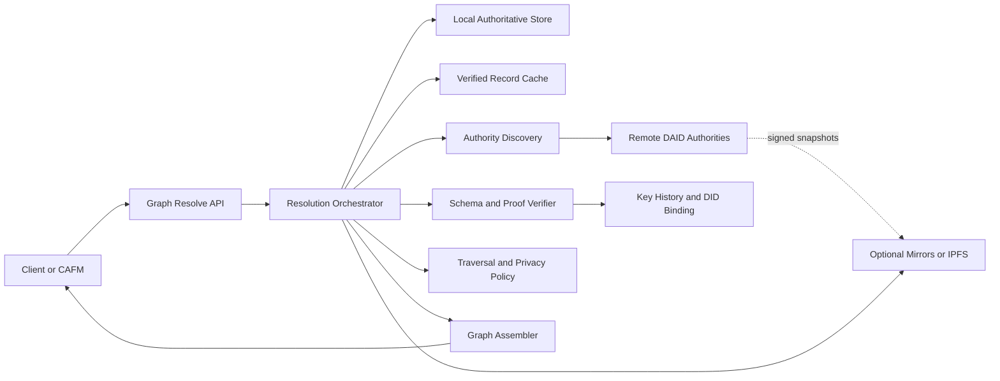

# DAID Instance-Based Dependency Network

Status: normative architecture for DAID protocol 3.0

Implementations MUST conform to this document's single wire schema, identifier,
proof, discovery, relationship, and graph-resolution contracts.

## 1. Executive Decision

DAID v3 represents an asset as a signed,
federated dependency graph. A physical asset installed at a site is represented
by an **instance record** issued by the asset owner's authority. That record is
the graph root and contains signed relationship assertions pointing to records
issued by manufacturers, suppliers, contractors, installers, maintainers, and
other lifecycle participants.

The design preserves DAID's defining properties:

- There is no global registry, ledger, mandatory relay, or shared database.
- Every DAID remains self-routing to an authority controlled by its issuer.
- Each authority remains the source of truth for its own records and claims.
- Records and relationship assertions are independently signed and cacheable.
- Resolution is on demand, bounded, cycle-safe, and useful during outages.
- Public, restricted, and private data can coexist without copying confidential
  source records into the owner's root record.

The DAID URI does **not** encode whether a record describes a product type or a
physical instance. It binds a routing hint, a self-certifying genesis authority,
and an opaque record identifier:

```text
daid://{routing-host}/{authority-key-fingerprint}/{uuid4}
```

Example:

```text
daid://assets.hospital.example/z6MkrJVnaZkeF6oD3BFXYiVQ3mYFZBcP/018f6f4e-f403-4b17-8b96-9d7ac3482a31
```

`routing-host` is only a bootstrap locator and is never a trust anchor. The
base58btc multihash `authority-key-fingerprint` identifies the offline genesis
public key. The genesis key signs delegated operational keys and locator
descriptors, so DNS takeover cannot forge records and a signed descriptor can
move service to new endpoints or mirrors without changing asset identity.

## 2. Architectural Principles

1. **Identity is stable; descriptions evolve.** A DAID identifies one logical
   subject for its lifetime. Mutable state is expressed through signed,
   monotonic record versions.
2. **Identity and location are separate.** The self-certifying authority key is
  the trust anchor; DNS, HTTPS endpoints, peers, and content networks are
  replaceable discovery mechanisms.
3. **An authority signs only its own claims.** The asset owner cannot impersonate
   the installer, and the installer cannot mutate the owner's root record.
4. **Relationships are evidence, not copied truth.** The root contains links and
   acceptance proofs; detailed lifecycle data remains at its issuer.
5. **Verification precedes traversal.** A resolver never follows links from an
   unverified payload unless an explicit diagnostic policy permits it.
6. **Partial graphs are normal.** Root resolution success is independent from
   child availability. Every node and edge has an explicit resolution status.
7. **Traversal is constrained.** Depth, node count, response bytes, concurrency,
   per-authority requests, and wall-clock time are bounded by policy.
8. **Incoming relationships are not globally discoverable.** An authority can
   publish outbound links and accepted assertions. Reverse lookup requires an
   explicitly configured index or peer and is never a protocol dependency.

## 3. Core Specification Update

### 3.1 Record Kinds and Scope

Protocol v3 introduces a required `schema_version` and `record_kind`:

| `record_kind` | Ownership and purpose |
|---|---|
| `type` | Manufacturer-owned reusable product, material, and performance definition |
| `instance` | Owner-owned identity for one physical, serialized, or installed asset |
| `assertion` | Stakeholder-owned lifecycle event or evidence package, such as custody or commissioning |
| `collection` | Authority-owned logical assembly, system, space, or package of assets |

An instance SHOULD link to a manufacturer type record with `defines_type`; it
MUST NOT duplicate the manufacturer's full specification as owner-authored
truth. An instance's `authority` is the genesis authority-key fingerprint in
its DAID. `controller` identifies the party currently authorized to publish
versions; it is not necessarily the manufacturer, custodian, operator, or
physical location.

Ownership transfer does not change the DAID. A transfer is an accepted,
co-signed `transferred_to` assertion plus a controller delegation signed by the
old and new controllers. The immutable delegation chain leads back to the
genesis key. DNS control alone never establishes asset control or legal
ownership.

### 3.2 Versioned Signed Envelope

The v3 envelope adds explicit signing metadata and instance semantics:

```json
{
  "id": "daid://assets.hospital.example/z6MkrJVnaZkeF6oD3BFXYiVQ3mYFZBcP/018f6f4e-f403-4b17-8b96-9d7ac3482a31",
  "authority": "z6MkrJVnaZkeF6oD3BFXYiVQ3mYFZBcP",
  "controller": "did:web:assets.hospital.example",
  "schema_version": "3.0",
  "record_kind": "instance",
  "subject": {
    "name": "Fire door FD-03-214",
    "serial_number": "FD-2026-009184",
    "asset_owner": "North Wing Hospital Trust",
    "site": {
      "building": "North Wing",
      "storey": "03",
      "space": "03-214",
      "ifc_guid": "2XQ$n5SLP5VgceJx2B9mA1"
    }
  },
  "relationships": [],
  "availability": {
    "minimum_verified_replicas": 3,
    "snapshot_every_version": true,
    "allow_content_networks": true
  },
  "created_at": "2026-09-15T09:30:00+00:00",
  "updated_at": "2026-09-15T09:30:00+00:00",
  "version": 1,
  "proof": {
    "type": "DaidJcsEd25519Signature2026",
    "verification_method": "did:web:assets.hospital.example#daid-signing-2026",
    "created": "2026-09-15T09:30:00+00:00",
    "proof_value": "base64url-signature"
  }
}
```

The entire envelope except `proof` is canonicalized with RFC 8785 JSON
Canonicalization Scheme (JCS) and signed. RFC 8785 replaces the current
Python-specific canonical JSON convention so independent implementations can
produce identical bytes. Floating-point values that cannot round-trip under
JCS MUST be represented as strings plus an explicit unit.

The bootstrap host serves a signed authority descriptor. A resolver accepts it
only when its genesis public key hashes to the DAID authority fingerprint and
its descriptor proof verifies:

```json
{
  "authority": "z6MkrJVnaZkeF6oD3BFXYiVQ3mYFZBcP",
  "genesis_public_key_multibase": "z6MkrJVnaZkeF6oD3BFXYiVQ3mYFZBcP",
  "protocol_version": "3.0",
  "endpoints": ["https://assets.hospital.example"],
  "mirrors": ["https://daid-mirror.city.example"],
  "verification_methods": [
    {
      "id": "did:web:assets.hospital.example#daid-record-signing-2026",
      "type": "Ed25519VerificationKey2020",
      "public_key_multibase": "z6Mk...",
      "purposes": ["record", "relationship-acceptance"],
      "valid_from": "2026-01-01T00:00:00Z",
      "valid_until": null,
      "revoked_at": null
    }
  ],
  "sequence": 7,
  "expires_at": "2026-10-15T00:00:00Z",
  "proof": "base64url-genesis-signature"
}
```

Resolvers require protocol `3.0`, select the proof key by ID and purpose, and
reject expired, rolled-back, or incorrectly signed descriptors. Historical
keys and descriptors MUST remain available from authorities and mirrors so old
lifecycle evidence remains verifiable after key rotation.

### 3.3 Relationship Semantics

Each root relationship is an immutable assertion embedded in the signed root
version. It points to an independently resolvable DAID and describes why it is
linked. A relationship has these identities:

- `relationship_id`: stable UUID for this assertion across root revisions.
- `source`: the root or parent DAID.
- `target`: the independently authoritative child DAID.
- `role`: the lifecycle participant role.
- `relation_type`: the graph meaning, independent of the participant role.
- `asserted_by`: authority making the external claim.
- `accepted_by`: root authority accepting it into the root graph.

Required lifecycle mappings are:

| Role | Recommended target record | `relation_type` | Typical authoritative data |
|---|---|---|---|
| Manufacturer | `type` | `defines_type` | Factory type, material, declarations, performance, warranty basis |
| Supplier | `assertion` | `custody_event` | Shipment, batch, chain of custody, delivery verification |
| Main contractor | `assertion` or `collection` | `procured_under` | Project/package reference, approved substitution, governance evidence |
| Installer | `assertion` | `commissioned_by` | Date fitted, location check, test result, photographic/document evidence |

Other v3 relation types include `contains_component`, `located_in`,
`maintained_by`, `inspected_by`, `replaced_by`, `supersedes`, and
`decommissioned_by`.

### 3.4 JSON Schema Extension

The following normative fragment is intended for the v3 JSON Schema 2020-12
document. It is the only asset-record wire schema.

```json
{
  "$schema": "https://json-schema.org/draft/2020-12/schema",
  "$id": "https://daid.example/spec/schema/asset-record-v3.json",
  "title": "DAID Asset Record v3",
  "type": "object",
  "required": [
    "id", "authority", "controller", "schema_version", "record_kind", "subject",
    "relationships", "availability", "created_at", "updated_at", "version", "proof"
  ],
  "properties": {
    "id": { "$ref": "#/$defs/daid" },
    "authority": { "type": "string", "minLength": 1 },
    "controller": { "type": "string", "minLength": 1 },
    "schema_version": { "const": "3.0" },
    "record_kind": {
      "enum": ["type", "instance", "assertion", "collection"]
    },
    "subject": {
      "type": "object",
      "required": ["name"],
      "properties": {
        "name": { "type": "string", "minLength": 1 },
        "serial_number": { "type": ["string", "null"] },
        "asset_owner": { "type": ["string", "null"] },
        "site": {
          "type": ["object", "null"],
          "properties": {
            "building": { "type": ["string", "null"] },
            "storey": { "type": ["string", "null"] },
            "space": { "type": ["string", "null"] },
            "ifc_guid": { "type": ["string", "null"] }
          },
          "additionalProperties": true
        },
        "attributes": { "type": "object", "additionalProperties": true }
      },
      "additionalProperties": true
    },
    "relationships": {
      "type": "array",
      "items": { "$ref": "#/$defs/relationship" }
    },
    "availability": {
      "type": "object",
      "required": [
        "minimum_verified_replicas", "snapshot_every_version",
        "allow_content_networks"
      ],
      "properties": {
        "minimum_verified_replicas": { "type": "integer", "minimum": 1 },
        "snapshot_every_version": { "type": "boolean" },
        "allow_content_networks": { "type": "boolean" }
      },
      "additionalProperties": false
    },
    "created_at": { "type": "string", "format": "date-time" },
    "updated_at": { "type": "string", "format": "date-time" },
    "version": { "type": "integer", "minimum": 1 },
    "proof": { "$ref": "#/$defs/proof" }
  },
  "$defs": {
    "daid": {
      "type": "string",
      "pattern": "^daid://[A-Za-z0-9.-]+(?::[0-9]+)?/z[1-9A-HJ-NP-Za-km-z]+/[0-9a-fA-F-]{36}$"
    },
    "relationship": {
      "type": "object",
      "required": [
        "relationship_id", "source", "target", "role", "relation_type",
        "asserted_by", "asserted_at", "state", "target_integrity", "proofs"
      ],
      "properties": {
        "relationship_id": { "type": "string", "format": "uuid" },
        "source": { "$ref": "#/$defs/daid" },
        "target": { "$ref": "#/$defs/daid" },
        "role": {
          "enum": [
            "manufacturer", "supplier", "main_contractor", "installer",
            "owner", "operator", "maintainer", "inspector"
          ]
        },
        "relation_type": {
          "enum": [
            "defines_type", "custody_event", "procured_under",
            "commissioned_by", "contains_component", "located_in",
            "maintained_by", "inspected_by", "replaced_by", "supersedes",
            "decommissioned_by"
          ]
        },
        "asserted_by": { "type": "string", "minLength": 1 },
        "accepted_by": { "type": ["string", "null"] },
        "asserted_at": { "type": "string", "format": "date-time" },
        "effective_from": { "type": ["string", "null"], "format": "date-time" },
        "effective_to": { "type": ["string", "null"], "format": "date-time" },
        "state": {
          "enum": ["proposed", "accepted", "superseded", "revoked", "disputed"]
        },
        "target_integrity": {
          "type": "object",
          "required": ["mode"],
          "properties": {
            "mode": { "enum": ["latest", "minimum_version", "snapshot"] },
            "version": { "type": ["integer", "null"], "minimum": 1 },
            "sha256": { "type": ["string", "null"], "pattern": "^[0-9a-f]{64}$" }
          },
          "additionalProperties": false
        },
        "claims": { "type": "object", "additionalProperties": true },
        "evidence": {
          "type": "array",
          "items": {
            "type": "object",
            "required": ["media_type", "sha256"],
            "properties": {
              "url": { "type": ["string", "null"], "format": "uri" },
              "ipfs_cid": { "type": ["string", "null"] },
              "media_type": { "type": "string" },
              "sha256": { "type": "string", "pattern": "^[0-9a-f]{64}$" }
            },
            "additionalProperties": false
          }
        },
        "proofs": {
          "type": "array",
          "minItems": 1,
          "items": { "$ref": "#/$defs/proof" }
        }
      },
      "additionalProperties": false
    },
    "proof": {
      "type": "object",
      "required": ["type", "verification_method", "created", "proof_value"],
      "properties": {
        "type": { "const": "DaidJcsEd25519Signature2026" },
        "verification_method": { "type": "string", "minLength": 1 },
        "created": { "type": "string", "format": "date-time" },
        "proof_purpose": { "type": "string" },
        "proof_value": { "type": "string", "minLength": 16 }
      },
      "additionalProperties": false
    }
  },
  "additionalProperties": false
}
```

For an accepted cross-authority relationship, `proofs` MUST contain:

1. An assertion proof from `asserted_by`, over the relationship payload with
   `proofs` omitted.
2. An acceptance proof from the root authority, over that same payload and the
   assertion proof digest.

The root record's envelope proof then commits to the complete accepted
relationship. This gives three verifiable facts: the stakeholder made the
claim, the owner accepted the pointer, and the owner published this graph
version.

### 3.5 Protocol Invariants

- Protocol v3 records use exactly one wire schema and one JCS signing profile.
- Unknown schema or protocol versions fail closed.
- Records are validated from their original received bytes; a resolver MUST NOT
  reconstruct a lossy signing dictionary from parsed model fields.
- Cached records retain the original payload bytes, proof, descriptor sequence,
  verification result, key ID, and verification time.
- All cross-authority relationship signatures are mandatory and verified. No
  feature flag may weaken signature, consent, transport, or traversal policy.
- Every accepted record version and lifecycle assertion is immutable. Corrections
  append a superseding version or assertion; they never rewrite signed history.

### 3.6 Lifecycle Event DAG

Lifecycle history is an append-only causal DAG, not a mutable status field and
not a globally ordered ledger. Each `assertion` record contains:

| Field | Requirement |
|---|---|
| `event_type` | Controlled term such as `manufactured`, `custody_transferred`, `delivered`, `installed`, `commissioned`, `inspected`, `maintained`, `fault_reported`, `repaired`, `replaced`, or `decommissioned` |
| `asset` | Root instance DAID that the event concerns |
| `issuer_sequence` | Monotonic sequence scoped to `(issuer, asset)` |
| `previous_event` | Previous event DAID from the same issuer and asset, or `null` for the first |
| `causes` | DAIDs of events from any authority that causally precede this event |
| `effective_at` | When the real-world event occurred |
| `recorded_at` | When the signed assertion was issued |
| `supersedes` | Incorrect assertion DAID being corrected, or `null` |
| `claims` | Minimal structured facts asserted by this issuer |
| `evidence_manifest` | Hash-pinned documents, measurements, images, or certificates |

Signatures authenticate issuer order; hashes and DAID references authenticate
causal links. Wall-clock timestamps MUST NOT establish conflict precedence by
themselves. Two concurrent assertions may both be valid. The owner records
acceptance, dispute, or rejection as a separate signed event, creating an owner
sequence without erasing stakeholder history.

Reducers derive current lifecycle state from verified events using deterministic
rules published by a profile, for example the DAID BIM Operations Profile. A
resolver returns both the event set and the reducer/profile identifier so a
consumer can reproduce the state instead of trusting a server-computed summary.

### 3.7 Product Baseline and Change Semantics

At installation or commissioning, `defines_type` MUST use `snapshot` integrity
mode and pin the exact manufacturer record version and SHA-256 JCS digest that
formed the accepted product baseline. On later resolution, the resolver also
attempts the current version of the same type DAID and reports one of:

- `unchanged`: current version equals the accepted snapshot.
- `updated_non_breaking`: manufacturer declares additive guidance or documents.
- `action_required`: recall, safety notice, invalidated certificate, or changed
  maintenance requirement applies to the installed instance.
- `incompatible`: current type no longer describes the installed configuration.
- `unknown`: current authority or applicable change assertion cannot be resolved.

A manufacturer update never silently rewrites an installed asset's historical
baseline. Applicability is a separately signed assertion that identifies the
affected type versions, serial/batch ranges, jurisdictions, and effective dates.

### 3.8 Replication and Durable Evidence

Every authoritative publish produces an immutable signed bundle containing the
original record bytes, proofs, authority descriptor chain, relationship proofs,
and evidence manifest. The authority pushes the bundle to independent mirrors
until `minimum_verified_replicas` acknowledge the exact digest. A publish may be
valid but is reported `under_replicated` until that policy is satisfied.

Mirrors, IPFS, and peer caches are availability providers only. They cannot
alter authority, controller, lifecycle state, or trust. Resolver fallback
accepts their bytes only when the genesis chain, record proof, and pinned digest
verify. High-value handover profiles SHOULD require at least three replicas
across two administrative operators, with one offline or content-addressed copy.

## 4. Decentralized Graph Resolution

### 4.1 Resolution API

The primary read operation resolves a graph. POST is used because traversal
policy and authorization context form a structured request:

```text
POST /v3/resolve-graph
{"root":"daid://...","depth":2,"max_nodes":50,"view":"public"}
```

The response is a graph envelope rather than a recursively nested object. A
node/edge table prevents duplication and represents cycles cleanly:

```json
{
  "root": "daid://assets.hospital.example/z6MkrJVnaZkeF6oD3BFXYiVQ3mYFZBcP/018f6f4e-f403-4b17-8b96-9d7ac3482a31",
  "complete": false,
  "nodes": {
    "daid://assets.hospital.example/z6MkrJVnaZkeF6oD3BFXYiVQ3mYFZBcP/018f6f4e-f403-4b17-8b96-9d7ac3482a31": {
      "status": "verified_current",
      "record": {}
    },
    "daid://installer.example/z6MkqR7VnaZkeF6oD3BFXYiVQ3mYFZBc/81cceaa3-c7fb-4d57-9755-75e00f20efde": {
      "status": "verified_stale",
      "record": {}
    }
  },
  "edges": [],
  "failures": [
    {
      "daid": "daid://supplier.example/z6MkxT8WpbA4hG7sN2cQ9rK5vD3eJ6Mf/c135e82b-f1a3-4391-87a2-463f4707ed9c",
      "status": "unavailable",
      "reason_code": "authority_unreachable",
      "last_verified_at": null,
      "retryable": true
    }
  ],
  "limits": {
    "requested_depth": 2,
    "reached_depth": 2,
    "max_nodes": 50,
    "truncated": false
  },
  "resolved_at": "2026-09-15T09:31:00+00:00"
}
```

`complete` means all in-scope links were attempted and verified within policy;
it does not imply that the global graph is known.

### 4.2 Recursive Resolution Algorithm

1. Parse and normalize the root DAID into `routing_host`, `authority_key_id`,
  and `record_uuid`. Reject malformed components and unsupported URI schemes.
2. Look up the exact root and latest signed authority descriptor in the local
  authoritative store or verified cache.
3. Resolve the authority descriptor from the routing host, known mirrors, and
  configured peers in parallel. Apply DNS/IP SSRF policy before each connection
  and redirect. Accept only a descriptor whose genesis key derives the DAID
  authority key ID, whose proof verifies, and whose sequence is not a rollback.
4. Select healthy HTTPS endpoints from the highest valid descriptor sequence.
  Fetch the record with conditional requests, bounded bytes, strict media type,
  and no cross-origin redirect. Require protocol and schema version `3.0`.
5. Verify the exact received JCS payload, proof purpose, operational-key
  delegation, controller chain, requested record UUID, and authority key ID.
6. If live resolution fails, try previously verified bytes and immutable bundles
  from descriptor mirrors, peer caches, and content-addressed networks. Apply
  the requested relationship's version and digest constraints before use.
7. Return an error only if the root has neither a verified live response nor an
  acceptable verified cached or mirrored copy.
8. Extract relationships only from the verified root. Validate that each edge's
   `source` equals the record containing it and verify all required relationship
   proofs before scheduling its target.
9. Deduplicate targets by normalized DAID. Maintain a visited set to terminate
   cycles. Record each edge independently even when its target was already seen.
10. Resolve child targets concurrently, with global and per-authority-key
   semaphores. Apply per-request timeout, total deadline, depth, node count,
   response byte, and relationship count limits.
11. Mark each child's data origin, descriptor sequence, key ID, verification
  time, freshness, and failure reason. Never substitute one authority's
   claim for another authority's unavailable claim.
12. Traverse verified child relationships only when the requested depth and
    policy allow it. Restricted views require authorization before their links
    are exposed or followed.
13. Assemble deterministically sorted `nodes`, `edges`, `failures`, and limit
   metadata. Include unresolved accepted edges so missing evidence is visible.
    Return the root and all successful children even when the graph is partial.

Default limits SHOULD be `depth=2`, `max_nodes=50`, `max_edges=200`,
`concurrency=8`, `per_authority_concurrency=2`, `per_request_timeout=5s`, and
`total_deadline=15s`. Deployments may lower these values; client requests may
never raise them beyond server policy.

### 4.3 Asynchronous Resolver Sketch

```python
from __future__ import annotations

import asyncio
from dataclasses import dataclass, field


@dataclass
class GraphResult:
    root: str
    nodes: dict[str, dict] = field(default_factory=dict)
    edges: list[dict] = field(default_factory=list)
    failures: list[dict] = field(default_factory=list)
    truncated: bool = False


async def resolve_graph(root_daid: str, policy: ResolvePolicy) -> GraphResult:
    result = GraphResult(root=root_daid)
    frontier = {root_daid}
    scheduled = {root_daid}
    request_slots = asyncio.Semaphore(policy.concurrency)
    deadline = asyncio.get_running_loop().time() + policy.total_timeout

    async def guarded_resolve(daid: str) -> ResolveOutcome:
        async with request_slots:
            try:
                async with asyncio.timeout(policy.per_request_timeout):
                    outcome = await resolve_one_with_fallback(daid, policy)
                return outcome
            except Exception as exc:
                return failure_outcome(daid, exc)

    for depth in range(policy.max_depth + 1):
        if not frontier:
            break

        remaining = deadline - asyncio.get_running_loop().time()
        if remaining <= 0:
            result.truncated = True
            result.failures.extend(deadline_failures(frontier))
            break

        tasks: dict[str, asyncio.Task[ResolveOutcome]] = {}
        try:
            async with asyncio.timeout(remaining):
                async with asyncio.TaskGroup() as group:
                    for daid in sorted(frontier):
                        tasks[daid] = group.create_task(guarded_resolve(daid))
        except TimeoutError:
            result.truncated = True
            result.failures.extend(deadline_failures(frontier))
            break

        next_frontier: set[str] = set()
        for daid in sorted(tasks):
            outcome = tasks[daid].result()
            result.nodes[daid] = outcome.as_graph_node()
            if outcome.failure:
                result.failures.append(outcome.failure)
            if not outcome.may_traverse:
                continue

            for edge in sorted(
                verify_relationships(outcome.record, policy),
                key=lambda item: item["relationship_id"],
            ):
                if len(result.edges) >= policy.max_edges:
                    result.truncated = True
                    continue
                result.edges.append(edge)

                target = edge["target"]
                if target in scheduled or depth >= policy.max_depth:
                    continue
                if len(scheduled) >= policy.max_nodes:
                    result.truncated = True
                    continue
                scheduled.add(target)
                next_frontier.add(target)

        frontier = next_frontier

    result.nodes = dict(sorted(result.nodes.items()))
    result.edges.sort(key=lambda item: item["relationship_id"])
    result.failures.sort(key=lambda item: item["daid"])
    return result
```

`resolve_one_with_fallback` classifies all expected network and verification
failures as data. `guarded_resolve` is the final isolation boundary so one child
cannot cancel its siblings. Cancellation closes HTTP responses, and cache writes
occur in short transactions only after complete verification. The concrete
implementation also maintains per-authority-key semaphores inside
`resolve_one_with_fallback`.

### 4.4 Failure and Degraded-Mode Semantics

Child failure MUST NOT convert a successfully verified root into an HTTP error.
Use HTTP `200` with `complete=false` and per-node outcomes:

| Status | Meaning | Resolver action |
|---|---|---|
| `verified_current` | Authority response verified and within freshness policy | Return and traverse |
| `verified_stale` | Previously verified record available but authority refresh failed | Return with timestamps; traverse only by policy |
| `snapshot_verified` | Immutable snapshot matches the edge digest | Return pinned version |
| `restricted` | Authority exists but caller lacks access | Return metadata-only failure, no sensitive detail |
| `not_found` | Authority authoritatively returned no such record | Preserve edge and report terminal failure |
| `unavailable` | Discovery, DNS, TLS, timeout, or server failure | Try cache/mirror, then report retryable failure |
| `invalid_signature` | Payload cannot be authenticated | Do not cache or traverse |
| `authority_mismatch` | Record identity does not match requested authority/DAID | Do not cache or traverse |
| `unsupported_schema` | No mutually supported schema profile | Preserve opaque diagnostic metadata only |
| `revoked` | Record or relationship has authenticated revocation | Return revocation evidence, do not use as active truth |

If an installer ceases trading, the root still resolves. The resolver returns
the accepted installer edge, the last verified commissioning assertion if one
is cached or digest-pinned, and a stale/unavailable status with timestamps. A
mirror can improve availability but cannot become the installer authority; its
copy is trusted only because the installer's historical signature verifies.

Authorities SHOULD publish signed snapshots to owner-selected mirrors or IPFS
for high-value handover evidence. Root edges using `snapshot` integrity mode
pin the exact accepted version. This avoids making continued corporate
existence a prerequisite for building safety records.

## 5. Security and Privacy Model

### 5.1 Write and Signature Workflow

A stakeholder does not directly edit another authority's root record:

1. The stakeholder creates an independently authoritative DAID record for its
   type definition, custody event, procurement package, or commissioning event.
2. It constructs a relationship payload linking the root to that record and
   signs it with a purpose-scoped key.
3. It submits the signed relationship proposal to the root authority.
4. The root authority validates both DAIDs, schema, signatures, key purposes,
   timestamps, replay nonce, and authorization policy.
5. The owner accepts, rejects, or disputes the proposal. Acceptance adds the
   owner's signature and publishes a new root version containing the assertion.
6. The owner signs the complete root envelope. Subscribers may receive an
   event, but events are notifications rather than trust anchors.

The relationship canonical payload includes `relationship_id`, `source`,
`target`, role, relation type, claims/evidence digests, target integrity policy,
state, timestamps, and a random proposal nonce. It excludes only `proofs`.

For owner-authored links such as `located_in`, one owner signature can be
sufficient. Cross-authority claims require stakeholder assertion and owner
acceptance. Revocation does not erase history: the revoking authority publishes
a signed revocation, and the root records a new relationship state/version.

### 5.2 Keys, Rotation, and Compromise

- Nodes SHOULD use distinct keys for record signing, relationship assertions,
  service authentication, and encryption.
- Every proof names a `verification_method`; bare unversioned public keys are
  insufficient for v3.
- Private keys SHOULD be held in an HSM, KMS, or OS-backed secret store.
- Discovery and `did:web` documents publish current and historical keys with
  validity intervals and revocation times.
- Verification uses the key valid at the proof creation time and applies local
  compromise policy. Revoking a key does not automatically erase all signatures
  created before compromise was known.
- DNS and HTTPS establish routing, while signed key history or DID binding
  provides continuity across endpoint and key changes.
- Signature verification, schema validation, and authorization are separate
  decisions and must be reported separately in audit logs.

### 5.3 Privacy and Selective Disclosure

DAID is a pointer network, not a mandate to publish entire business records.
Each authority maintains at least two data models:

- **Private source record:** ERP, commercial terms, margins, internal pricing,
  personal data, and operational notes. It never enters a public DAID payload.
- **Federated projection:** minimal claims needed by other participants, signed
  independently and linked to the private source by an internal identifier or
  one-way commitment.

A supplier can therefore publish:

```json
{
  "record_kind": "assertion",
  "subject": {
    "event_type": "delivery_verified",
    "batch": "B-20418",
    "quantity": 12,
    "delivered_at": "2026-09-12T14:10:00Z",
    "conformance": "accepted",
    "purchase_order_commitment": "sha256:4f5c..."
  }
}
```

It does not publish unit cost, margin, invoice amount, buyer contacts, or the
purchase order itself.

Three access profiles are recommended:

| View | Mechanism | Suitable data |
|---|---|---|
| Public | Anonymous signed projection, aggressively cacheable | Product declarations, non-sensitive conformance, public manuals |
| Partner | OAuth 2.0/OIDC capability token or mTLS, audience- and scope-bound | Project references, detailed custody evidence, restricted certificates |
| Confidential | Encrypted payload or document key wrapped to named recipients | Commercial terms, personal data, security-sensitive site information |

Restricted responses MUST still expose a non-sensitive status such as
`restricted`; they MUST NOT reveal whether a particular confidential field
exists. Shared caches must key by authorization context and never cache private
responses as public.

For proof of a hidden value without disclosure, the authority MAY publish a
salted Merkle commitment or issue an SD-JWT/Verifiable Credential. Unsalted
hashes of low-entropy values such as prices are unsafe because they can be
guessed. Selective-disclosure suites are optional extensions; ordinary signed
public projections are the interoperability baseline.

### 5.4 Resolver Security Controls

- Permit only `https` authority discovery in production; local HTTP requires an
  explicit development policy.
- Resolve DNS and enforce an SSRF allow/deny policy before every redirect and
  connection, including IPv4/IPv6 private, link-local, and metadata ranges.
- Limit redirects, decompressed bytes, JSON depth, relationship count, and
  schema complexity.
- Bind fetched `id` and `authority` exactly to the requested DAID before cache.
- Reject duplicate JSON keys before canonicalization.
- Use constant-time cryptographic libraries and never fetch a key URL supplied
  only by an unverified record; key IDs must bind to trusted discovery/DID data.
- Partition negative caches by failure type and use short TTLs for transient
  failures.
- Apply authorization before resolving restricted descendants to avoid graph
  existence leaks.

## 6. Component Architecture



No component in this diagram is a central service. Discovery is performed from
the authority in each DAID, caches are local, and mirrors are optional,
replaceable stores of issuer-signed bytes.

## 7. Step-by-Step Implementation Roadmap

### Phase 0: Freeze Protocol and Threat Model

Scope:

- Freeze the self-certifying URI, authority descriptor, v3 record kinds,
  relationship vocabulary, JCS profile, proof format, and graph result statuses.
- Add normative schemas under `docs/schema/` and golden canonicalization/signature
  fixtures for Python and at least one independent implementation.
- Complete threat models for authority compromise, endpoint takeover, malicious
  graph fan-out, metadata leakage, replay, rollback, and permanent node loss.
- Specify controller delegation, ownership transfer, key recovery, revocation,
  and mirror selection before implementation begins.

Acceptance gate: all v3 fixture bytes are identical across implementations,
every state transition has an authorization rule, and unknown versions fail
closed.

### Phase 1: Versioned Models and Cryptographic Envelope

Modify:

- `node/app/core/models.py`: add `RecordKind`, `AssetSubject`,
  `RelationshipAssertion`, `Proof`, `TargetIntegrity`, v3 request/response
  models, and strict v3 parsing.
- `node/app/core/crypto.py`: add RFC 8785 canonicalization, proof key IDs,
  relationship assertion/acceptance signing, descriptor verification, and
  controller delegation verification.
- `node/app/api/discovery.py` and `node/app/api/node_info.py`: advertise the
  protocol version, graph capabilities, verification methods, and limits.
- `node/app/config.py`: add resolver limits, production transport policy, cache
  freshness, mirror policy, and privacy policy settings.

Do not replace Ed25519. Wrap the existing key manager behind a signer/verifier
interface so HSM and KMS implementations can be added without changing record
models.

Acceptance gate: unit tests cover payload tampering, proof removal, wrong key
ID, authority mismatch, descriptor rollback, key rotation, controller transfer,
and malformed JSON.

### Phase 2: Persistence and Migrations

Modify:

- `node/app/db/orm_models.py`: store `schema_version`, `record_kind`, original
  signed payload, proof metadata, verification timestamp/status, and cache source.
- Replace the local-only edge foreign-key assumption with globally addressable
  source and target DAID columns; a remote source/target need not exist in the
  local `assets` table.
- Add unique constraints for relationship IDs and signer roles, indexes for
  source/target/state, and immutable assertion/version history.
- `node/app/db/database.py`: introduce an explicit migration mechanism before
  changing production schemas; startup `create_all` is not a migration strategy.

Suggested logical tables are `asset_records`, `asset_versions`,
`relationship_assertions`, `relationship_proofs`, `verification_cache`, and
`key_history_cache`. JSON payload storage remains appropriate initially; graph
columns are indexed separately for traversal.

Acceptance gate: initialize and migrate a v3 database through at least one
forward schema revision, restart safely, and verify historical signatures from
stored original payloads.

### Phase 3: Relationship Proposal and Acceptance Workflow

Modify:

- `node/app/api/relationships.py`: split creation into proposal, acceptance,
  rejection/dispute, and revocation operations; enforce signer role and root
  authority ownership.
- Add idempotency keys and optimistic concurrency (`If-Match`/root version) so
  concurrent proposals cannot overwrite one another.
- Harden the relationship API. Never report an edge as accepted merely
  because signature strings are present; verify the exact payload, key purpose,
  authority, controller authorization, and state transition.
- Add outbound relationship summaries to v3 root records while the full signed
  assertion remains retrievable by relationship ID.

Recommended endpoints:

```text
POST /v3/relationships/proposals
POST /v3/relationships/accept
POST /v3/relationships/reject
POST /v3/relationships/revoke
```

Acceptance gate: manufacturer, supplier, contractor, and installer authorities
can each issue a child record and complete a two-authority acceptance workflow;
replays and signatures over modified payloads are rejected.

### Phase 4: Single-Record Resolver Hardening

Refactor:

- `node/app/federation/resolver.py`: separate discovery, fetch, schema validation,
  proof verification, cache fallback, and outcome classification. Reuse one
  injected `httpx.AsyncClient` with bounded connection pools.
- `node/app/api/resolve.py`: return explicit verification evidence and preserve
  stale fallback reasons. Do not label all locally cached records `verified=true`
  without stored verification evidence.
- Enforce HTTPS and SSRF protections, redirect checks, payload limits, conditional
  requests with ETag, and per-authority circuit breakers.

Acceptance gate: deterministic tests simulate timeout, DNS failure, 404, 500,
bad TLS, bad signature, stale cache, unsupported schema, and recovered authority.

### Phase 5: Bounded Federated Graph Resolver

Add:

- `node/app/federation/graph_resolver.py`: breadth-first asynchronous traversal,
  deduplication, cycle detection, limits, deadline propagation, and partial result
  assembly.
- `node/app/api/resolve.py`: `POST /v3/resolve-graph` with depth, limits,
  relationship filters, refresh, and authorized view parameters.
- Graph response models in `node/app/core/models.py`.
- Metrics for authority latency, cache outcome, verification failure, truncation,
  and graph completeness without logging confidential payloads.

The graph resolver follows verified links across authorities and reports each
unavailable branch without failing a verified root.

Acceptance gate: a six-node integration test resolves a graph with a cycle,
duplicate target, slow child, offline installer, invalid supplier signature,
and depth/node truncation while preserving a verified root.

### Phase 6: Privacy Views and Authorization

Add:

- Projection policies that construct public or scoped partner views before
  signing; never redact fields after signing.
- OAuth 2.0/OIDC JWT validation or mTLS for partner views, with audience,
  subject, scope, expiry, and project/asset authorization checks.
- Response `Vary`, private cache controls, audit events, and encrypted document
  key distribution for confidential evidence.
- Optional commitment and selective-disclosure credential support behind a
  negotiated capability.

Acceptance gate: automated tests prove public callers cannot infer restricted
fields, shared caches cannot cross-contaminate views, expired/wrong-audience
tokens fail, and public proof verification remains offline-capable.

### Phase 7: SDK, CLI, BIM, and Operational Rollout

Modify:

- `client/daid_client.py`: add v3 record classes, trust state, `resolve_graph`,
  async streaming/progress callbacks, cancellation, and typed partial failures.
- `node/app/api/jsonld.py`: expose relationship semantics using stable JSON-LD
  terms without changing signed source bytes.
- BIM adapters: map instance DAIDs to `IfcElement`/`GlobalId`, type DAIDs to
  `IfcTypeObject`, and accepted edges to applicable `IfcRel*` entities.
- `docs/architecture.md`, examples, and compose demos:
  document normative behavior and add owner/manufacturer/supplier/contractor/
  installer/offline-mirror scenarios.

Rollout order:

1. Freeze schemas, threat model, conformance vectors, and operational profiles.
2. Harden persistence, cryptography, discovery, and identity layers.
3. Enable type, assertion, and owner-root instance issuance for pilot authorities.
4. Enable relationship proposals and bounded graph resolution with observability.
5. Exercise authority loss, ownership transfer, and key recovery drills.
6. Promote the implementation only after all security and conformance gates pass.

Acceptance gate: end-to-end BIM handover creates an instance root, links all
four required lifecycle roles, resolves with one authority offline, exports
stable IFC mappings, and verifies every returned claim independently.

## 8. Test Strategy

Unit tests:

- URI normalization and authority binding
- v3 JCS canonicalization and signature fixtures
- Record, relationship, acceptance, revocation, and historical-key proofs
- Schema version dispatch and malformed/oversized input
- Traversal cycle, depth, node, edge, deadline, and deduplication behavior
- Privacy projection and authorization decisions

Integration tests:

- Multi-authority proposal and acceptance
- Cold resolve, warm cache, stale cache, immutable snapshot, and mirror fallback
- Concurrent resolution with one slow and one malicious authority
- Key rotation and compromised-key policy
- Restricted child with public parent and unauthorized caller

Contract tests:

- Signed authority discovery and descriptor rollback across independent v3 nodes
- Python client against each supported server profile
- Golden JSON/JCS/signature vectors usable by non-Python implementations

Operational tests:

- Restore signed records and key history from backup
- Continue resolution after authority DNS/server loss
- Bound memory, sockets, and response size for adversarial high-fan-out graphs
- Verify that logs, traces, and metrics contain no confidential projections

## 9. Explicit Non-Goals

- DAID does not become a blockchain or require consensus over asset state.
- DAID does not provide a global search index or reverse-link registry.
- DAID does not copy every participant's source data into an owner-controlled
  record.
- DAID does not treat an optional mirror, IPFS gateway, gossip peer, DID resolver,
  or ActivityPub relay as a universal dependency.
- DAID signatures prove issuer control and payload integrity; legal identity,
  regulatory acceptance, and truth of a claim remain policy and assurance
  questions outside the base transport protocol.

This architecture turns DAID into an instance-based lifecycle network while
keeping authority local, verification portable, and failure contained to the
unavailable branch of the graph.